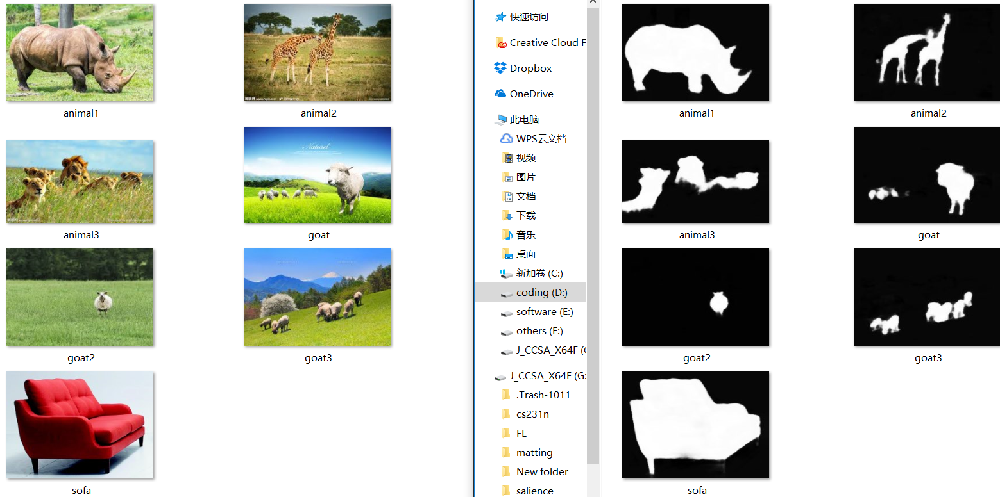

# Salient-Object-Detection
This is tensorflow implementation for cvpr2017 paper "Deeply Supervised Salient Object Detection with Short Connections"

<h3>Pretrained Model</h3>
https://drive.google.com/open?id=0B6l9O8aWij8fUGtVNldUTXA4eHc

<h3>Usage</h3>
1. Download pretrained model and put them under folder "salience_model" ,(need to create folder yourself)<br />
2. run code<br />

If you want to test whole folder images, run this:  

```
python inference.py --rgb_folder=[your folder]
```

sample:  

```
python inference.py --rgb_folder=./test
```

If you want to test only one image,run this:  

```
python inference.py --rgb=[your image]
```

sample:

```
python inference.py --rgb=animal1.jpg
```

<h3>Sample</h3>



more detail please read source code.
